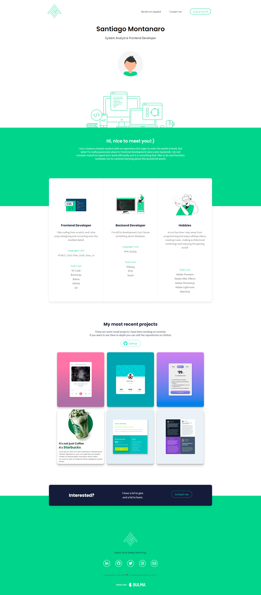

## Table of contents

- [Overview](#Overview)
  - [Links](#links)
  - [Screenshot](#screenshot)
- [My process](#My-process)
  - [Built with](#Built-with)
- [Author](#Author)

## Overview

- My personal portfolio so you can see a summary of what I can do and what tools I use :)

### Links

- Live Site URL: [https://santiagomontanaro.github.io/portfolio_eng/]

### Screenshot

### My process

### Built with

- Semantic HTML5 markup
- CSS3 custom properties
- CSS Grid Layout
- Flexbox
- Bulma
- Fontawesome

Based on Matt Farley's website

## Author

- Twitter - [@santimontana_](https://twitter.com/santimontana_)
- Instagram - [@lllliiiiilllj](https://www.instagram.com/lllliiiiilllj/)
- Linkedin - [@santiago montanaro](https://www.linkedin.com/in/montsan/)
